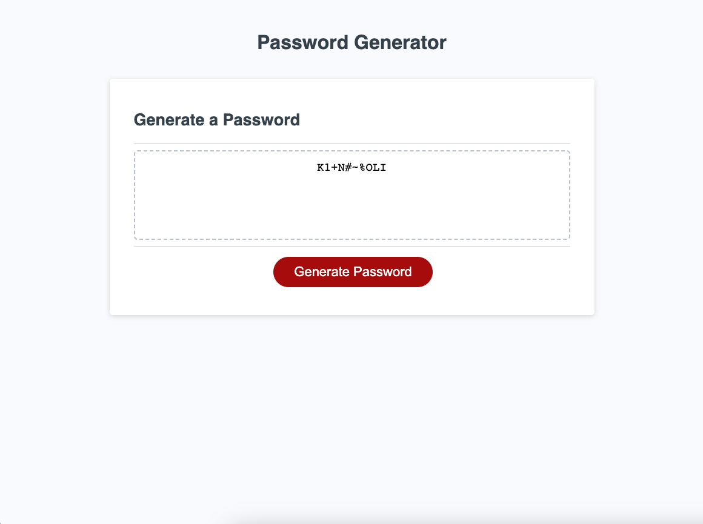

# Random Password Generator

## Project Description

This project was my first foray into the world of JavaScript. While I didn't touch the HTML or CSS for this site all of the functionality (besides the connective base code) was provided by me.

Some challenges I faced through this project include learning what the order of operations should be for the code to function properly and also the use of and structure of a for loop.

With the help of a tutor I was able to impliment an error code in the case that the user opted out of selecting any option. 

## Website in Action

## Helpful Links

Premade Arrays:
https://gist.github.com/bendc/1e6af8f2d8027f2965da?permalink_comment_id=3968850

## Deployed Website for Testing

## License

MIT License

